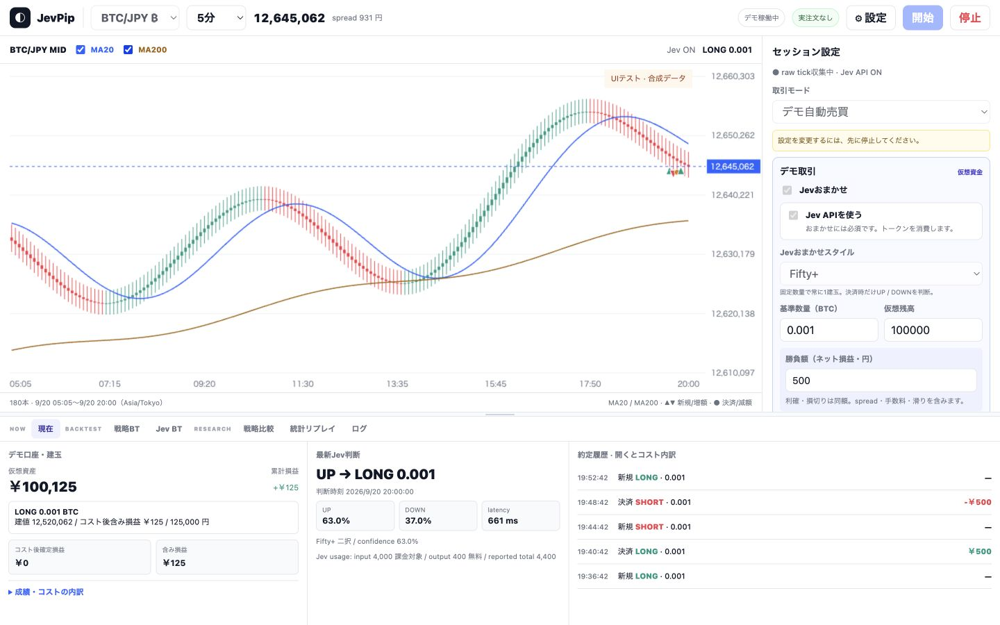
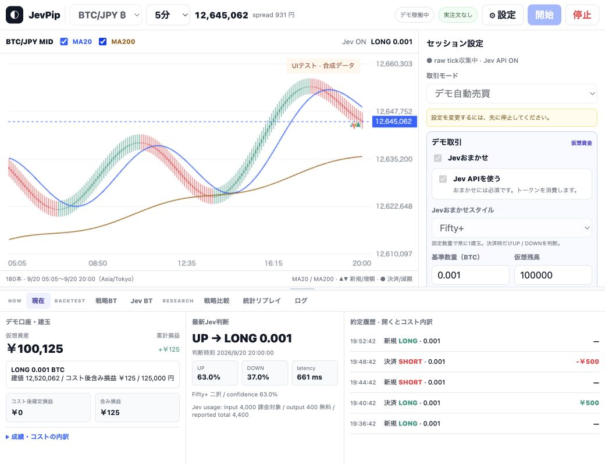

# Desktop UI review — Issue #2

2026-09-20〜21、`fb9beb7` を起点に実ブラウザで確認。Desktop 1440×900 / 1040×800、最小幅の確認は1000×800。変更前の画面を保存して作業メモに問題を列挙し、その後に修正した。

## 目視で見つけた問題と対応

| 操作・場所 | 優先度 | 変更前 | 対応 |
| --- | --- | --- | --- |
| 1. セッション設定 | P1 | 状態カード4枚と説明で、スタイル・数量が折り返しより下 | 重複する状態表示を統合。mode → おまかせ → API → style → 数量・残高の順に整理 |
| 2. 開始・再読み込み | P0 | 実行中もmode・数量・判断間隔を変更できる。BTC実行中のreloadでUSD/JPYが固定表示される | 開始中・実行中の入力をロック。銘柄、mode、数量、cadence、研究設定を実際の開始時設定から復元 |
| 3. 狭いDesktop | P1 | BTCの大きな価格桁で設定・開始・停止ボタンが縦に折れて欠ける | 操作ボタンの幅と一行表示を確保。認証状態は設定画面へ移動 |
| 4. 現在ビュー | P1 | 成績カードの下に建玉が隠れ、履歴11列が狭い領域に並ぶ | 資産・累計損益・建玉・確定/含み損益を先頭へ。履歴を新しい順にし、行を開くと価格・費用・理由を表示 |
| 5. チャート | P1 | 180本しかなくMA200が描けない。長い時間足の約定が30秒条件で落ちる | 199本の準備データを追加し表示は180本を維持。約定時刻を含む足にマーカーを描画 |
| 6. 状態・設定ダイアログ | P1 | 選択済みpaperでも「選ぶと動く」と表示。開始待ちの二重クリック、設定の保存行の欠け | 空状態と開始/停止待ちを明示。設定のヘッダー・操作行を固定し、focusをダイアログ内で循環・閉じた後に復帰 |
| 7. 少量データ・詳細表示 | P2 | 少ない足で時刻が重なる、確率を持たない目標判断でもUP/DOWN/FLAT枠が並ぶ | 足の実際の配置幅に応じて時刻の本数を調整。該当しない確率枠を隠す |

## 表示の統合・移動

- 常時表示していた認証バッジはAPI設定に集約。
- sidebarの実行状態・口座・最新判断の重複を省き、上部の実行状態と現在ビューを主な確認場所にした。既存IDは保持。
- 判断間隔の入力、動作・コスト説明、詳細成績・診断は折りたたみへ。研究機能自体は残した。
- Fifty+は固定数量、FXはネットpips、BTCはネット損益の円額と説明。通常スタイルの数量倍率説明との混在を解消。
- BTのAPI/TOKEN説明を1枚に統合。Jev BTの課金表示・見積り・確認手順は維持。

## チャート

- 180本の表示密度を維持。MA20/200は表示範囲より前の足も計算に利用。
- `/api/chart/history` に省略可能な `warmup=true` を追加。既存の既定値180本は維持し、UIは379本を要求。FXの1時間足では週末を挟んでも準備できるよう、探索上限を32日に限定して拡大。
- 最初・最後の足の余白、価格の桁数に合わせた軸幅、11pxの軸文字、縦幅に応じたgrid本数、MAを含む価格範囲を調整。
- MA20は青、MA200は茶。準備不足は「準備中」と表示。日付・時刻・timezoneを常時表示。
- データのない時間を架空の足で埋めず、圧縮した時間の境目を縦の点線で示す。
- 新規/増額は方向別の三角、決済/減額は丸。約定価格を使用し、時間足を跨いだ誤配置を防ぐ。
- 時間足変更時は読み込み状態を表示し、異なる時間足の旧履歴を混ぜない。取得失敗は同一銘柄・時間足のcacheのみ利用。

## ブラウザ確認

| 操作 | 結果 |
| --- | --- |
| USD/JPY・BTC、1分/5分/15分/1時間 | 確認。公開履歴と合成データで価格桁・時間軸・マーカーを目視 |
| MA20/MA200 ON/OFF | 描画の切り替え、MA200の全表示範囲、3本しかない場合の準備不足を確認 |
| 観測のみ・デモの開始/停止 | APIキーなし、Jev OFFで実行。開始中のボタン・入力ロックも確認 |
| 実行中reload | BTC/観測mode、BTC/paper mode・0.002 BTC・仮想残高200000の復元を確認 |
| おまかせON/OFF・3スタイル・数量/残高・Fifty+幅 | 確認。円額とpipsの切り替え、詳細制約の開閉・入力を確認 |
| Jev API ON/OFF | OFFの観測・paperと、ONでキー未設定から設定への案内を確認 |
| 研究設定・全6タブ | 開閉と切り替えを確認。Jev BTは見積り・課金の表示まで |
| 設定 | 未設定・usage・参照専用口座、保存（変更なし）/キャンセル/閉じる/Escape、Tab循環を確認 |
| terminal高さ・window幅 | ドラッグ、上下キー、ダブルクリック、1440→1000→1040で再描画と操作ボタンを確認 |
| empty / sparse / error | 独立した合成APIで0本・3本・取得失敗を確認。少量時の時刻重なりを修正 |
| 約定詳細 | 展開後もpollで閉じないこと、実デモの降順データ・合成の昇順データとも新しい順になることを確認 |

Jevへの有料API呼び出しは行っていない。実Jevの判断結果と実口座残高の接続確認は今回の対象外。画面内の合成データはレイアウト確認専用で、モデル性能・取引成績の実測値ではない。

## 検証

- `uv run pytest`: 231 passed。
- `node --test tests/web_ui.test.cjs`: 11 passed。MA200、足の結合、4種類の時間足の約定位置、準備不足、設定ロック・復元、履歴の並びとHTML escapingを検証。
- JavaScript構文チェック、`git diff --check`。正常フローでJavaScriptの実行エラーなし。取得失敗fixtureの502は意図したもの。
- 実注文・private注文POST・live tradingは追加していない。既存の安全境界テストも通過。追加したsession設定は公開可能なfeature/policy/cadenceのみで、認証情報を含まない。

## 意図的に残したもの

- Desktopで情報密度を保つため、右側の詳細項目は縦スクロール。モバイルの再設計は行わない。
- 従来戦略・研究BTの全列テーブルは詳細検証用として維持。現在ビューだけをコンパクトにした。
- 同じ足・同じ価格の複数約定は重なる。全件の確認は履歴で行えるため、チャートのhoverや集約バッジはLater。
- FX休場・未提供データ、公開イベント取得先の403など外部要因はUIで解決しない。データ状態を明示する。

確認した範囲では、v1のDesktop主要動線を妨げる未解決のP0/P1は残っていない。

## 最終画面（合成データ）

